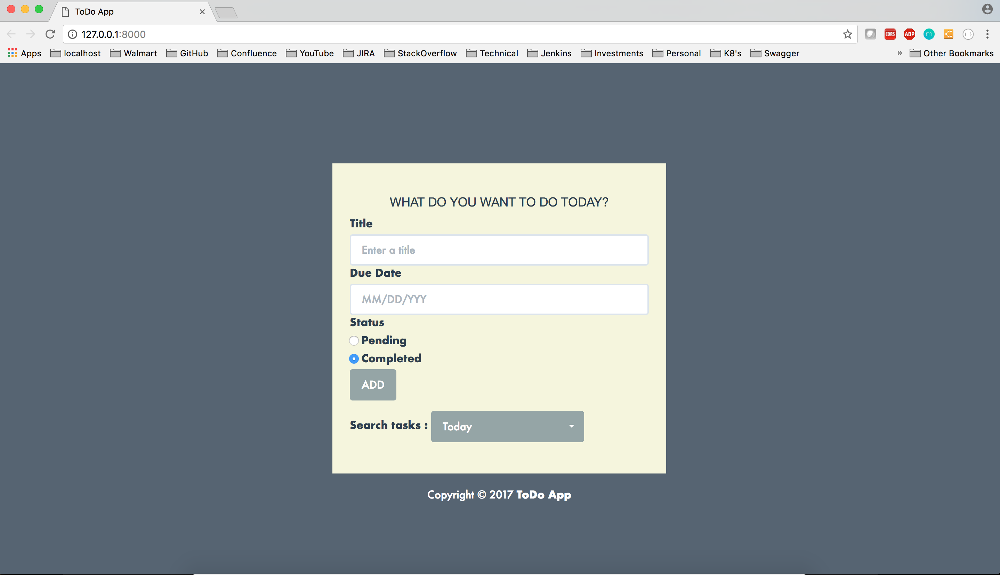
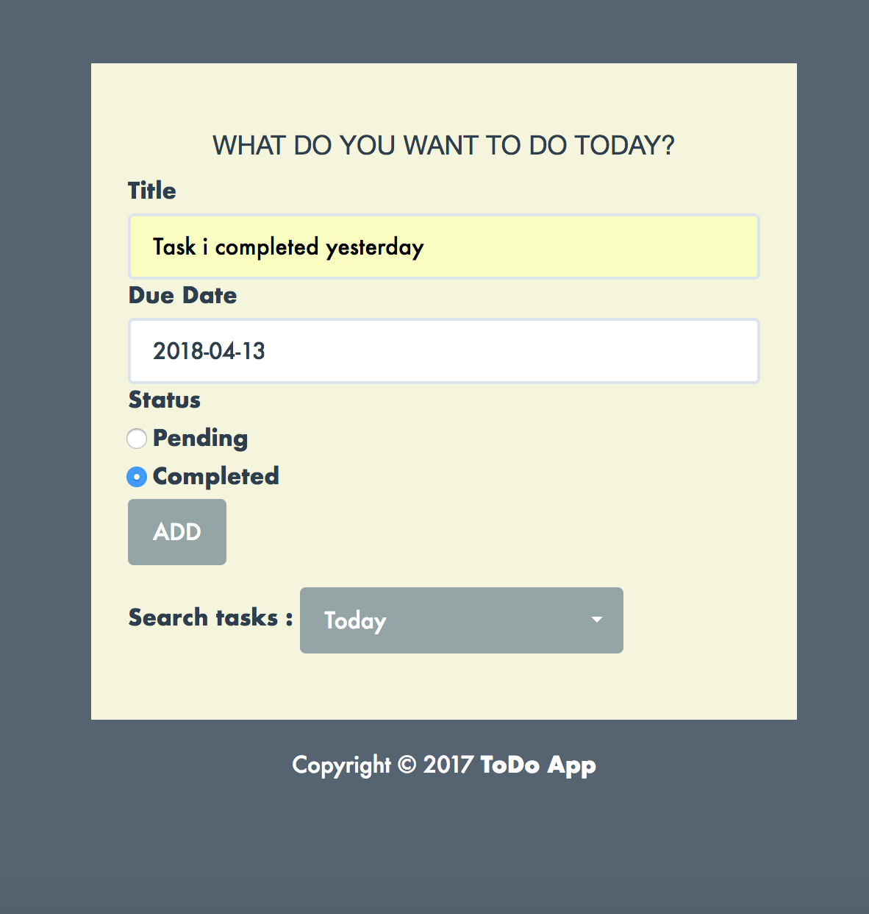
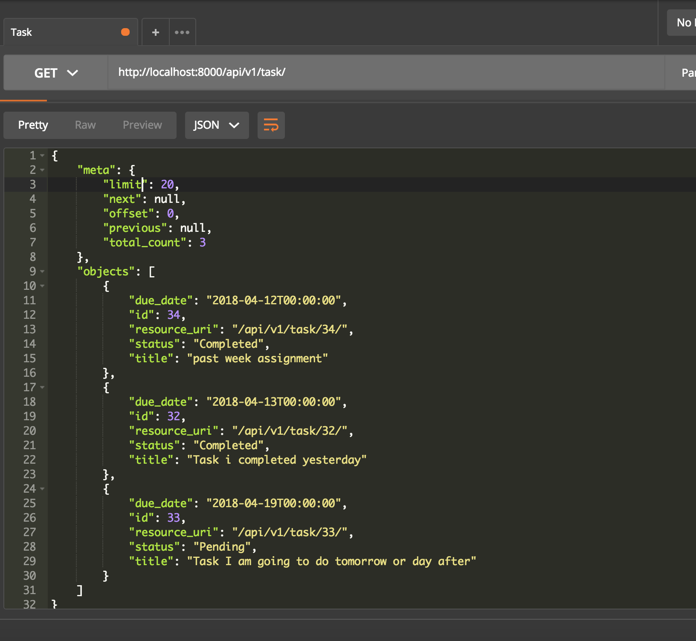
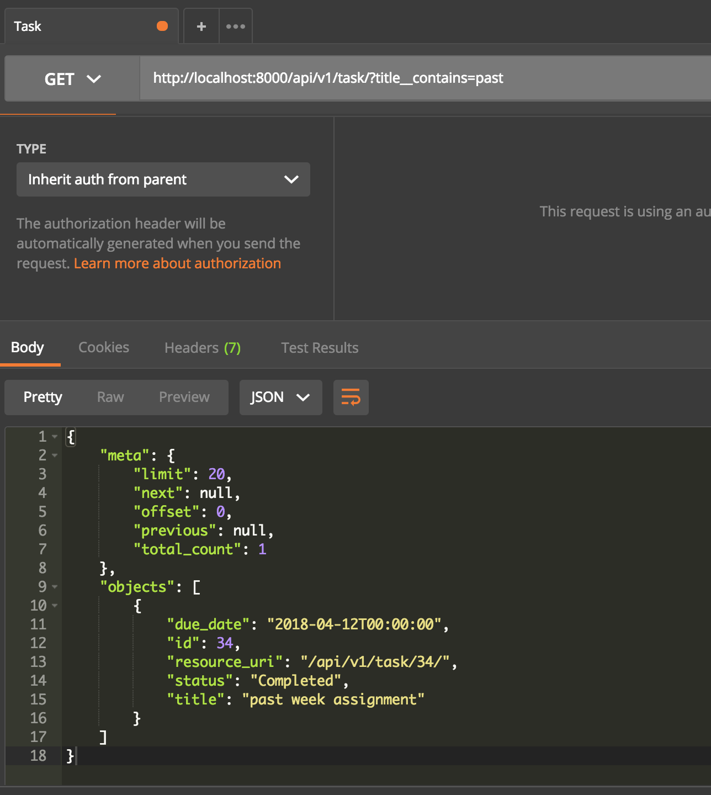

# To_Do_Application
## This is a sample ToDo app using Django and TasyPie

### Run the project 
```
python3 manage.py migrate`
python3 manage.py testserver`
```
### OR Buid using Docker image
Using Docker file
```
docker build -t django-to_do_app .
docker run --name=Django -td django-to_do_app
```

## Specs and feature

1. A task will have a `title` and `due-date`.



2. There are only 2 state applicable for task. Pending or Completed 
Restricting the user from the UI 


3. Ascending by due date
`http://localhost:8000/api/v1/task/`


4.Search (on `title`) should be available
`http://localhost:8000/api/v1/task/?title__contains=past`


5.Filtering on `due-date` should be possible using the following — Today, This
week, Next week, Overdue
*Search criteria*
* dateRange=today  `http://localhost:8000/api/v1/task/?dateRange=today`
* dateRange=overdue  `http://localhost:8000/api/v1/task/?dateRange=overdue`
* dateRange=last_week  `http://localhost:8000/api/v1/task/?dateRange=last_week`
* dateRange=next_week  `http://localhost:8000/api/v1/task/?dateRange=next_week`

Examples for all :
