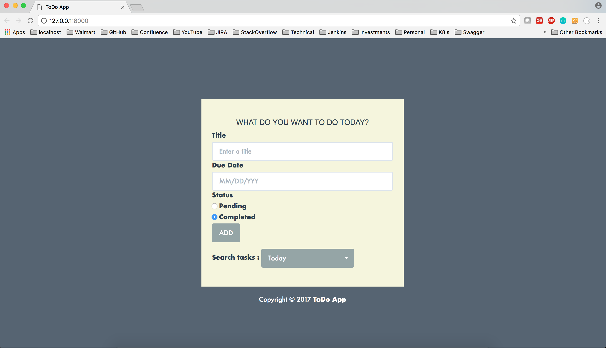
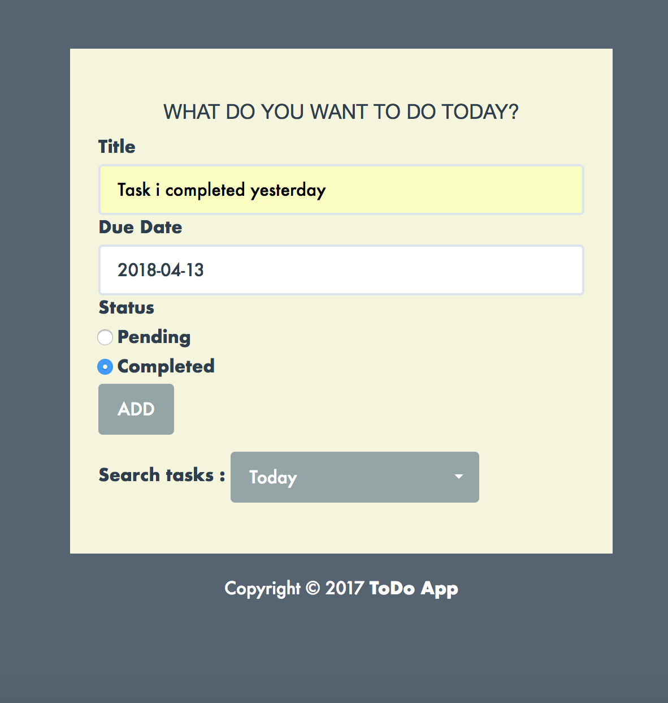

# To_Do_Application
##This is a sample ToDo app using Django and TasyPie

### Run the project 
`python3 manage.py migrate`
`python3 manage.py testserver`

### OR Buid using Docker image
Using Docker file
`docker build -t django-to_do_app .`
`docker run --name=Django -td django-to_do_app`

## Specs and feature

1. A task will have a `title` and `due-date`.

2. There are only 2 state applicable for task. Pending or Completed 
Restricting the user from the UI 

3. Ascending by due date
`http://localhost:8000/api/v1/task/`

